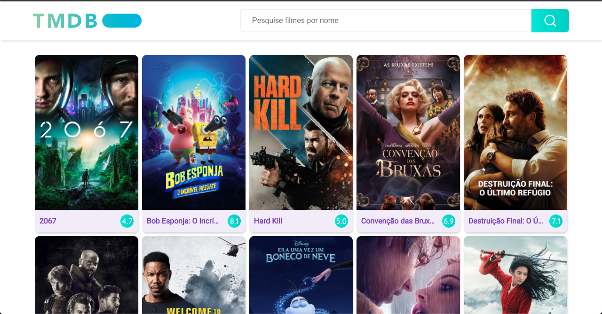
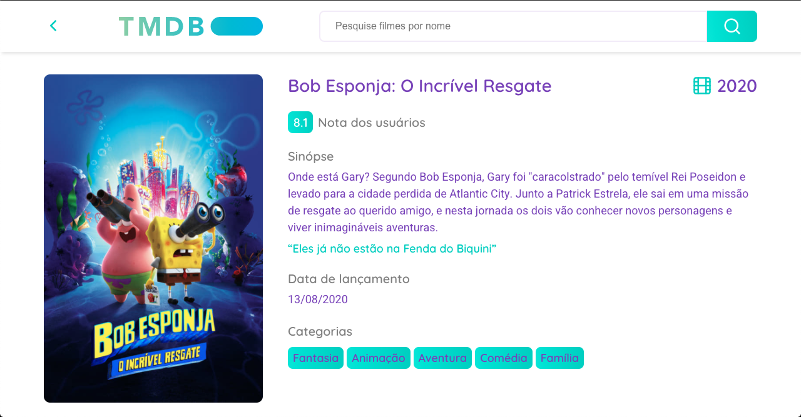
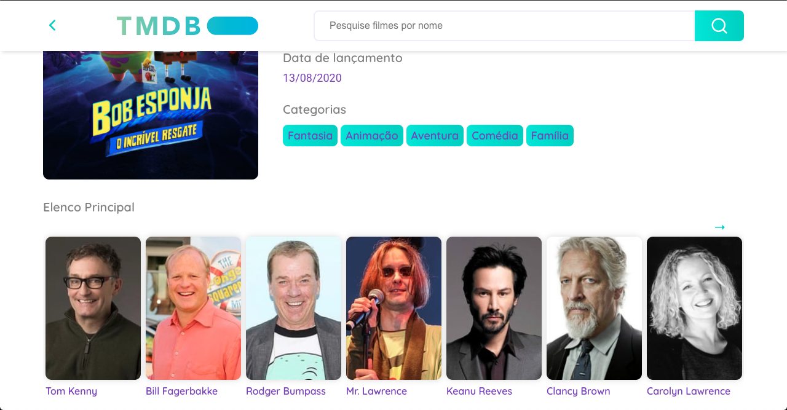
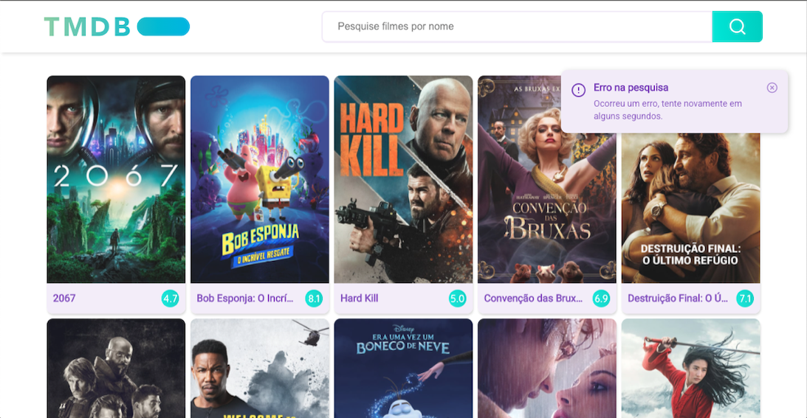

<p align="center">TMBD Movies - Desafio</p>
<h4 align="center">Versão 1.0 🚀</h4>

<p align="center">
 <a href="#-sobre">Sobre</a> •
 <a href="#-layout">Layout</a> •
 <a href="#-rotas-da-api">Rotas da API</a> •
 <a href="#-executando-o-happy">Como executar</a> •
 <a href="#tecnologias">Tecnologias</a> •
 <a href="#como-contribuir">Como contribuir</a> •
 <a href="#-licença">Licença</a>
</p>

---

## 💡 Sobre

Desnvolver uma aplicação que liste os filmes mais populares do momento, para isso você deverá consumir a API do [TheMovieDB](https://www.themoviedb.org/), na tela inicial deverá mostrar uma listagem dos filmes mais populares, os mais populares sendo exibidos no topo da lista, utilizar o mecanismo de paginação fornecido pela API.

Cada item da lista deve levar para uma página de detalhes do filme, aonde deve ser mostrado todos os atributos importantes do filme, como por exemplo: title, description, rating, etc.

Deve ser possível realizar pesquisa por filmes em qualquer tela, a request de pesquisa deve ser disparada utilizando o processo de controle de fluxo Debounce​ com um limite de tempo de 500ms, esse controle deve ser feito devido ao limite de requests por segundo que a API impõe.

Sobre a limitação de requests por segundo da API do TheMovieDB, esse limite deve ser tratado e deve ser exibido um feedback visual não invasivo para o usuário indicando que não foi possível realizar a operação devido a limitação da API e solicite que ele tente novamente em alguns segundos.

---

## 🎨 Layout


### Web

<p align="center">
  
  
  
  
  
</p>

---

## 🍃 Rotas da API

GET - https://api.themoviedb.org/3/movie/popular?api_key=${apikey}&language=pt-BR&page=${page} --> pega a lista dos filmes mais populares <br>
GET - https://api.themoviedb.org/3/movie/${ID}?api_key=${apikey}&language=pt-BR --> Pega informaões mais detalhadas do filme selecionado<br>
GET - https://api.themoviedb.org/3/movie/${id}/credits?api_key=${apikey}&language=pt-BR --> Pega o elenco do filme<br>
GET - https://api.themoviedb.org/3/movie/${id}/external_ids?api_key=${apikey} --> Pega as redes sociais do filme<br>
GET - https://api.themoviedb.org/3/search/movie?api_key=${apikey}&language=pt-BR&query=${query}&page=${page} --> Faz uma busca por filme<br>

---

## 💻 Executando a aplicação

### Pré-requisitos

É necessário ter instalado na sua máquina para execução desse projeto:
- NodeJS
- Gerenciador de pacotes (Npm ou Yarn)

### ♊ Clonando o Repositório

```bash

$ git clone git@github.com:anddersonrds/tmdb-movies.git

# entre na pasta do projeto

$ cd tmdb-movies

```
### 💻 Rodando a aplicação

Instale as dependências

```bash

$ yarn

# ou, caso use npm

$ npm install

```

Rode a aplicação

```bash

$ yarn start

# ou, caso use npm

$ npm start

```

---

<h2 id="tecnologias"> 🛠️ Tecnologias </h2>

As ferramentas usadas no desenvolvimento do projeto.

#### SPA React:
- Typescript
- ReactJS ⚛️
- React Router Dom
- React Icons
- Styled Components
- Context Api
- Axios

---

<h2 id="como-contribuir"> ⚙️ Como contribuir </h2>

- Faça um fork desse repositório;
- Crie uma branch com a sua feature: `git checkout -b minha-feature`;
- Faça commit das suas alterações: `git commit -m 'feat: Minha nova feature'`;
- Faça push para a sua branch: `git push origin minha-feature`.

---

## 📝 Licença

Este projeto está sob licença [MIT](./LICENSE).

#Feito com [@AnddersonRds](https://github.com/anddersonrds)

